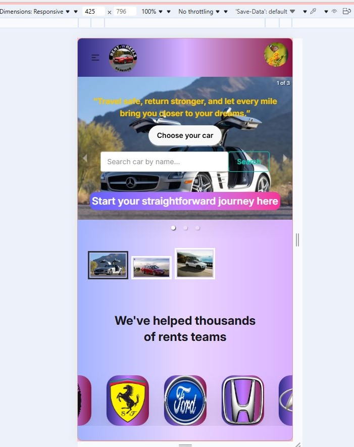
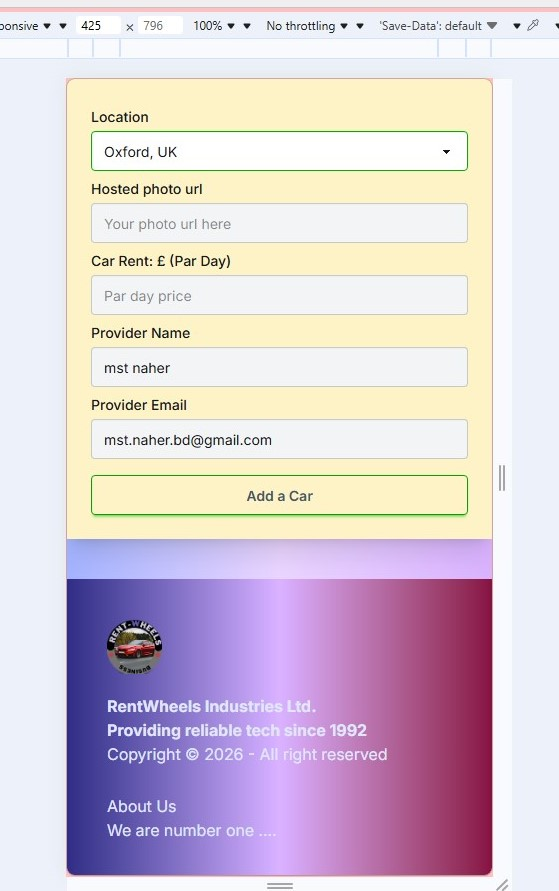
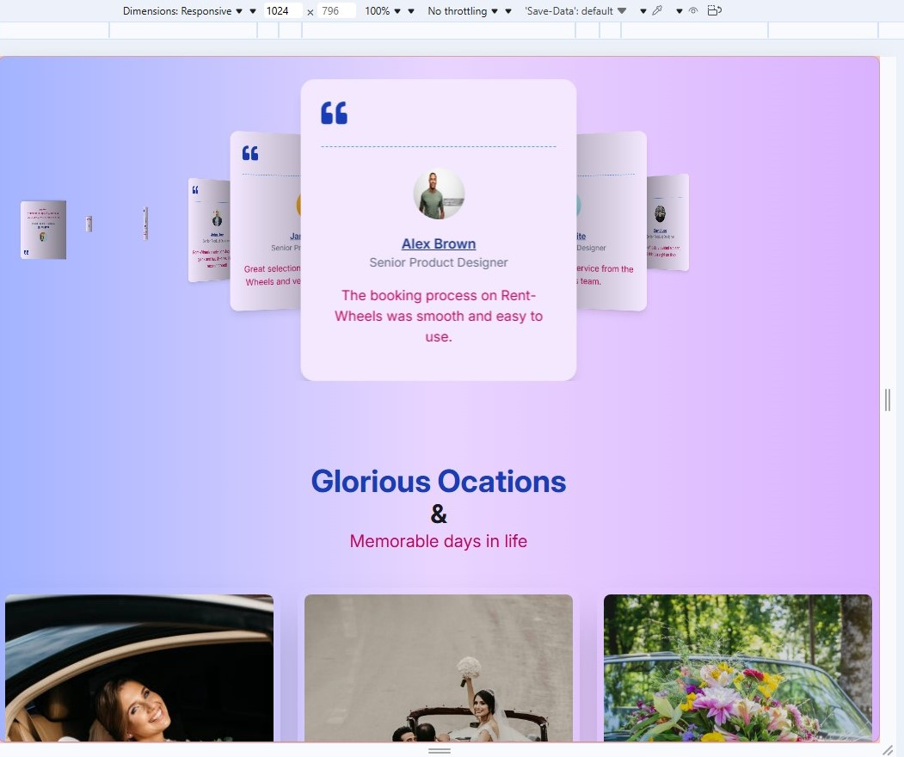
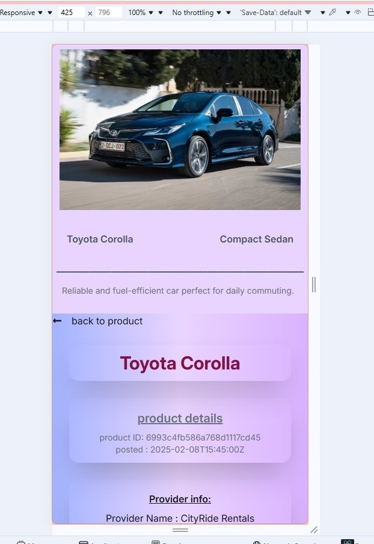

# React Project: Rent Wheels
# Project: Links
 - Live
 - https://teal-kleicha-551ddc.netlify.app/
 - https://rent-wheels-server-two.vercel.app/ 
 
  - GitHub
  - https://github.com/Mst-naher/rent-wheels-server
  - https://github.com/Mst-naher/rent-wheels-client

  
  
  
  

## Main Features of the Rent Wheels Website
 - Users can create an account and log in easily.

 - Car details like price, model, and availability are clearly shown.

 - The website offers different types of cars for rent.

 - The design is simple and easy to use for everyone.

 - The website works well on mobile phones and computers.

## Expanding the ESLint configuration

